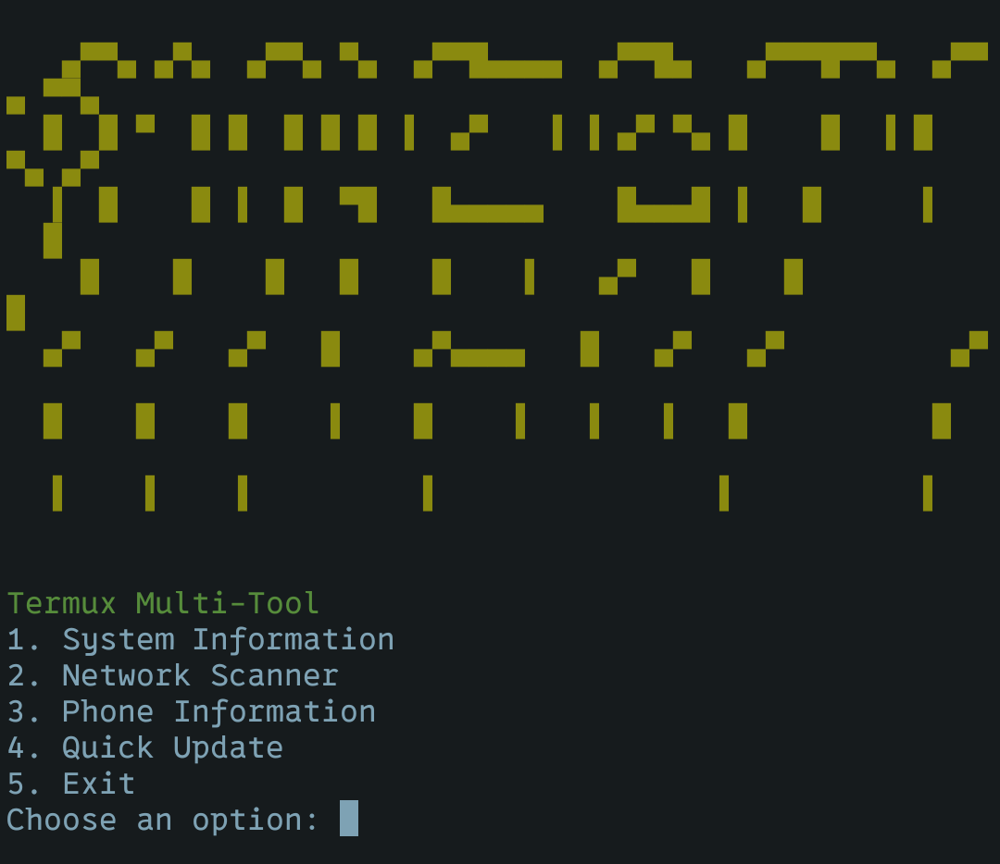

# Termux Multi-Tool 🔧

[](LICENSE.md)
[](https://github.com/trickytermux/termux-basic/commits/main)
[](https://termux.com)
[](https://www.gnu.org/software/bash/)
[](https://nmap.org)
[](https://en.wikipedia.org/wiki/Network_scanner)
[](https://developer.android.com)


A comprehensive toolkit for Termux users to analyze and manage Android devices through CLI.



## Features 🌟

- **System Diagnostics**  
  📊 Kernel version | Uptime | Storage/RAM monitoring | Device specs
- **Network Analysis**  
  🌐 IP scanning | Host discovery | Nmap integration
- **Device Insights**  
  📱 Battery status | Hardware info | WiFi details | Sensor data
- **Maintenance**  
  🔄 One-click updates | Auto-dependency installer

## Installation ⚙️

1. Clone repository:
```bash
git clone https://github.com/trickytermux/termux-basic.git
```

2. Change Directory
```bash   
cd termux-basic
```

3. Make it Executable
```bash
chmod +x tool.sh
```

4. Run Tool
```bash
./tool.sh
```


## Termux-API Setup 🔌

1. **Install Termux-API App**:
   - [F-Droid Version](https://f-droid.org/en/packages/com.termux.api/)
   - [GitHub Release](https://github.com/termux/termux-api/releases)

2. **Install Termux-API Package**:
```bash
pkg install termux-api
```

3. **Grant Permissions**:
   - Allow storage access
   - Enable location (optional)
   - Accept device sensors access

4. **Restart Termux** after installation

## Usage 🚀

Start the tool:
```bash
./tool.sh
```

**Menu Options**:
1. **System Information** - Device health check
2. **Network Scanner** - Discover connected devices
3. **Phone Information** - Hardware/software insights
4. **Quick Update** - Update all packages
5. **Exit**

## Command Cheatsheet 💻

| Function                  | Command                          |
|---------------------------|----------------------------------|
| Basic network scan        | `nmap -sn 192.168.1.0/24`       |
| Full device information   | `termux-telephony-deviceinfo`    |
| Battery status check      | `termux-battery-status`          |
| Update all packages       | `apt update && apt upgrade -y`   |
| Check WiFi connection     | `termux-wifi-connectioninfo`     |

## Dependencies 📦

- `nmap` (auto-installed)
- `termux-api` (auto-installed)
- `jq` (auto-installed for JSON formatting)

## Permissions 🔐

- **Required**:  
  - Storage access
  - Phone state
- **Optional**:  
  - Location services
  - Device sensors
  - WiFi information

## Contributing 🤝

1. Fork the repository
2. Create feature branch:  
   `git checkout -b feature/new-feature`
3. Commit changes:  
   `git commit -m 'Add awesome feature'`
4. Push to branch:  
   `git push origin feature/new-feature`
5. Open a pull request

## License 📄

MIT License - See [LICENSE](LICENSE.md) for full text

## Support ❤️

Leave a ⭐ if you find this useful!  
[Report Issues](https://github.com/trickytermux/termux-basic/issues)
